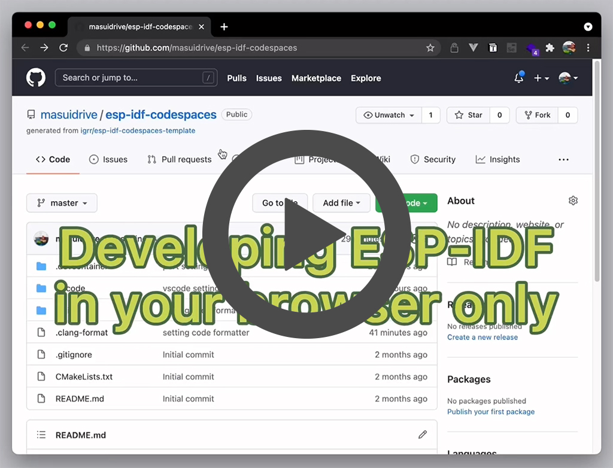

# Example of ESP-IDF developing environment on Github Codespaces or VS Code Remote

<a href="https://youtu.be/md5ci_08o1E">
  

    
  

</a>

- Configured ESP-IDF and ESP-ADF environment
- Install [Espressif IDF](https://marketplace.visualstudio.com/items?itemName=espressif.esp-idf-extension) and [ESP Updater extension](https://marketplace.visualstudio.com/items?itemName=masuidrive.vsc-esp-updater) for Codespaces and VS Code Rmote
  - ESP Updater extension required Google Chrome on Windows / macOS
- Configured [ClangFormat](https://clang.llvm.org/docs/ClangFormat.html)
- License: [CC0](https://creativecommons.org/share-your-work/public-domain/cc0/) / Public Domain

If you run it on Github Codespaces, you need to sign up to [Codespaces](http://github.com/codespaces) first.
